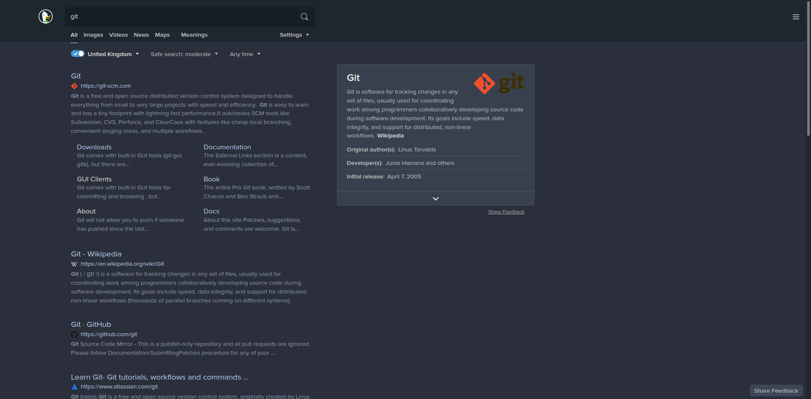

## DarkBlue Ice for duckduckgo

### A Beautiful theme for duckduckgo with dark blue and ice colors distributed in a harmonic way.

---

## Working

### Check the preview of the theme [here](https://duckduckgo.com/?ko=s&kj=1e262f&kx=C3D6F9&k7=2A2F3B&k8=919DB3&k9=C3D6F9&kaa=C3D6F9&k21=39404D&)

### To install follow the steps:

* Copy the content of the [darkblueice.js](https://github.com/Dedsd/DarkBlue-Ice-for-duckduckgo/blob/master/darkblueice.js)
* Paste on your browser console on duckduckgo website
* If you made the steps rigth, now your duckduckgo looks amazing with the DarkBlue Ice theme!

---

## Credits

### Script by [ Alicia Sykes](https://github.com/Lissy93)

---

Made by [André V.](https://github.com/Dedsd)